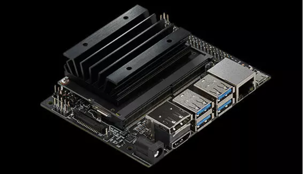
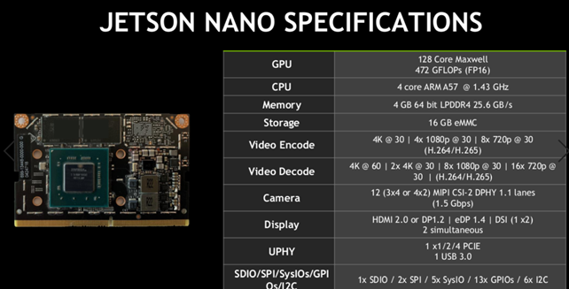
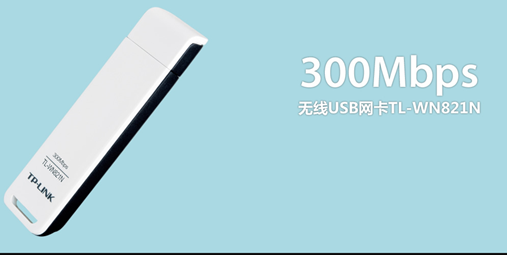
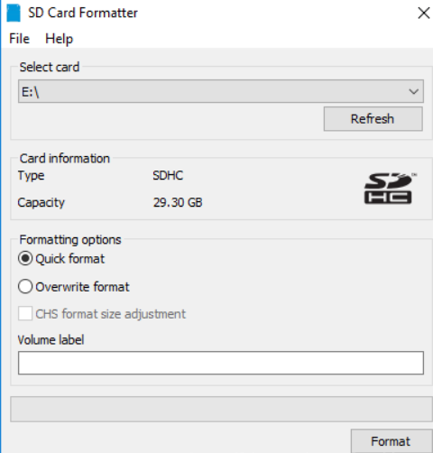
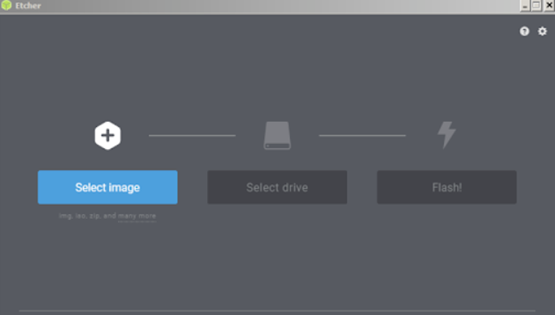
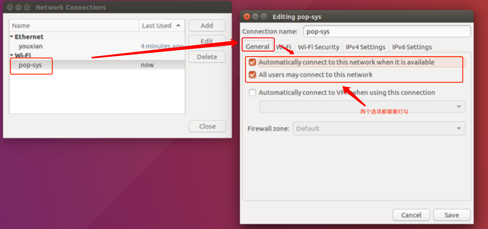

# **jetson Nano使用经验**

###  **一.关于jetson Nano**
...百度一搜一大堆，总之很强大，性价比又高，还有**gpu**，还支持**cuda**

 

***


### **二.安装系统心得**
(参考自https://blog.csdn.net/beckhans/article/details/89136269c)

总体上安装系统还是比较容易的，但是系统大小比较大，镜像之后有12个G大小，至少要使用32个G以上的储存卡才足够满足需要。  

**具体安装步骤如下：**  

**（一）前期准备**  

1.电源线（必备  

`5V⎓2A`的`MicroUSB`电源线。（推荐的话电流还是3A以上）  
如果要使用DC线供电的话，要将跳线帽插在j48脚上。

2.SD卡 （必备）  

`至少32G`

3.无线网卡 （选配）  

Jetson Nano无内置wifi模块，也没有内置蓝牙模块，但是它只能识别一些特定型号的网卡，亲测`TP-LINK`的`TL-WN821N`无线网卡可以自动识别（但是这种网卡型号比较老）另外网上说`360`某型号网卡也可以自动识别，可以自行查找。该开发板也可以接入网线。
网卡图片如下：


补充说明：如图所示的网卡宽度太大，会浪费开发板一个宝贵的usb接口，因此开发时建议使用网线。当然如果有合适大小的网卡也很好。

4.显示屏（必备，需要HDMI线）  

jetson nano自带的桌面共享有bug，一打开就会跳出。SSH的访问比较容易，系统本身自带了SSH功能且设置了开机自启动，可以直接访问（类似于树莓派）。如果开发的功能需要在图形化界面显示出一些东西的话，在开发过程中也需要使用显示屏。

**（二）系统烧录** 

1.下载镜像  
直接将镜像压缩包下载到电脑中即可    
下载地址如下：  
英伟达官方地址：https://developer.nvidia.com/embedded/dlc/jetson-nano-dev-kit-sd-card-image

2.格式化SD卡  
使用SD Card Formatter格式化SD卡，直接百度就能找到，下载安装，FORMAT一键式格式化，如果电脑上只插了一个外部存储设备的话，还可以自动识别。  
SD Card Formatter使用界面如下：



3.使用Etcher写入镜像  
也是一键式，非常好用  
下载地址如下：https://www.balena.io/etcher/  
使用界面如下




整个写入过程大概需要25分钟  

**注意：安装完成之后windows系统会提示新的磁盘需要格式化才能使用，千万不要选择格式化，因为其中有一个盘会是你刚刚烧录进的系统。烧录之后原来的SD卡的隐藏盘会被windows识别出来，也不要合并这些磁盘。一定要保持烧录之后的状态不变，这样系统才能正式启动。**

4.烧写完成后插入SD卡，插电即可开机  
英伟达给的官方动图可以说是很形象了


5.开机之后完成一些必要的设置  
系统为为jetson Nano特制的Ubuntu18.04  
**注意：一定要记得调整系统的日期和时间设置，如果时间设置的不对的话将无法访问一些网站，后续的更新也将无法完成**

补充：实现jetson nano的远程桌面访问的方法  
首先使用ssh进行远程访问的方法很简单，jetson nano开机即自启动了ssh的协议，但是需要注意的是，在初始的状态下，如果你没有设置为自动登录（即不需要输入账号密码）的话，在登录上去之前jetson nano是无法链接上网络的。因此为了方便的话可以设置为自动登录。  

如果不想设置自动登录的话也可以，只需要在网络链接的设置界面设置一下想要链接的wifi参数即可。具体设置见图片：  

参考自（https://blog.csdn.net/oTengYue/article/details/81510226）


如果想用vnc来实现的话，本身jetson nano自带的桌面共享是有问题的，不支持桌面共享。因此无法远程调用它原生的gnome桌面。因此我们可以换种思路再在jetson nano的板子下再安装一个桌面xfce来实现远程访问。
具体步骤如下：  

（1）安装xfce:  
```
sudo apt-get install xfce4
``` 

(2)安装vncserver：  
```
sudo apt-get install vnc4server
```

(3)运行vncserver并设置密码  

(4)配置xstartup文件(推荐使用gedit修改，jetson nano中自带了gedit)   
修改xstartup文件内容，针对Xfce4桌面环境.  
修改~/.vnc/xstartup中的内容为：   
```
#!/bin/sh  
unset SESSION_MANAGER  
unset DBUS_SESSION_BUS_ADDRESS  
startxfce4 &  

 
[ -x /etc/vnc/xstartup ] && exec /etc/vnc/xstartup  
[ -r $HOME/.Xresources ] && xrdb $HOME/.Xresources 

xsetroot -solid grey
```
(5)重启（reboot）就可以看到效果了   
注：在这里每次vncserver在nano上启动都会开启一个新的桌面号：因此通过vnc访问时要在ip地址后再加一个1：  如`192.168.137.128:1`

**注意：因为本身ubuntu的的系统占用了接近一半的内存空间，因此建议在使用远程桌面访问前关闭ubuntu的图形界面（需要使用显示器），这样远程访问效果会比较好。关闭图形界面的命令见下文。**

再补充：使用RDP（远程桌面访问协议）也可以实现对nano的远程访问，但是目前来说bug较多不推荐，能用显示屏开发还是用显示屏开发，用远程桌面访问系统还是太卡。
***
### **三.安装必要的开发包的经验**
jetson Nano本身自带了很多必要的开发包，但是如果你想用python进行开发的话，这些安装包应该都需要进行环境配置

1.实现调用摄像头  

这块板子本身是没有带相关的安装包的，所以，如果要使用摄像头的话，需要先安装fswebcam包  

命令如下：
```
sudo apt-get install fswebcam
```

2.链接蓝牙音箱（nano本身没有音频线接口，所以只能使用蓝牙音箱或者HDMi显示屏上的音频输出）

本身jetson nano自带了蓝牙驱动，但是没有蓝牙模块，需要插入外置的蓝牙模块，设置后虽然可以配对上设备，但是在声音的设备界面还是无法找到对应的设备，这时需要安装blueman,命令如下： 
``` 
sudo apt install blueman -y
```
确认一下是不是安装了蓝牙模块：
```
sudo apt-get install pulseaudio-module-bluetooth
```
之后输入命令：
```
pactl load-module module-bluetooth-discover
```
加载寻找蓝牙设备的模块。这样操作之后就可以找到对应的蓝牙音箱设备。

**注意：该命令需要在蓝牙设备管理器连接设备之前进行，否则的会报错：'模块初始化失败'。另外，记得在连接成功之后在声音设置界面选择正确的输入和输出设备,还需要将选择设备的配置改为A2DP信宿**

3.安装pip  
系统自带了3.6和2.7两个版本的python，但是没有自带pip包，安装pip的命令如下(以python3为例)
```
 sudo apt-get install python3-pip
```

4.安装opencv  

因为这款板子的系统是基于aarch64定制的ubuntu，因此用sudo apt-get或者pip命令只能安装为其定制的某个版本的软件包，或者干脆找不到包。以下以opencv的安装为例

如果想简单的使用的话，系统本身自带了opencv的3.3.1版本，python2应该可以直接使用（未尝试）

若未报错，则证明opencv已经安装好了

对于python3来说要想简单的安装opencv也有途径，但是版本只能是3.2.0(也许后续系统会更新，能用更新版本的opencv)
命令如下：
```
sudo apt-get install python3-opencv
```

若想安装更加新的版本的opencv则需要进行编译安装了  
实现方式如下  
可以通过写一个安装脚本  
（引自Github：JetsonHacksNano/buildOpenCV）  
由于代码行数过多  
脚本详见文件 buildOpenCV.sh  
将.sh文件拷贝到Home下，执行即可自动编译  
编译成功后会返回 ``OpenCV make sucessful``  

**注意：jetson nano的内存虽然有4g，但是Ubuntu的图形界面就占据了一个多g大小。因此在编译之前建议关闭图形界面（不关图形界面必死机）**  
关闭和开启图形界面的命令如下：    
关闭：
```
sudo systemctl set-default multi-user.target
sudo reboot
```
开启：
```
sudo systemctl set-default graphical.target
sudo reboot
```

之后要进行安装，在opencv文件夹下执行命令：
```
sudo make install
```
即可完成安装
这时在python3下再执行如下代码测试
```
import cv2
cv2.__version__
```
就会返回opencv的版本号，其中安装opencv的版本可以在.sh文件中进行修改。
***
### **四.在nano编译安装wukong.robot，实现语音机器人**
其实用nano这块板子来做语音机器人有一些大材小用，不过就当做一个学习的一个步骤吧。（参考自https://wukong.hahack.com）  
由于架构的不同，在nano上编译安装与在其他平台上的安装略有不同。

1.安装篇  

(1).克隆GitHub上的仓库
```
git clone https://github.com/wzpan/wukong-robot.git
```
(2).安装 sox ，ffmpeg 和 PyAudio：
```
sudo apt-get install python-pyaudio python3-pyaudio sox pulseaudio libsox-fmt-all ffmpeg
pip3 install pyaudio
```
(3).安装其他依赖的库
```
cd wukong-robot
pip3 install -r requirements.txt
```
(4).手动编译snowboy
安装swig：
```
wget http://hahack-1253537070.file.myqcloud.com/misc/swig-3.0.10.tar.gz
tar xvf swig-3.0.10.tar.gz
cd swig-3.0.10
sudo apt-get -y update
sudo apt-get install -y libpcre3 libpcre3-dev
../img/jetson/configure --prefix=/usr --without-clisp --without-maximum-compile-warnings
make
make install
install -v -m755 -d /usr/share/doc/swig-3.0.10
sudo cp -v -R Doc/* /usr/share/doc/swig-3.0.10
sudo apt-get install -y libatlas-base-dev
```

构建snowboy
```
wget http://hahack-1253537070.file.myqcloud.com/misc/snowboy.tar.bz2  # 使用fork出来的版本以确保接口兼容
tar -xvjf snowboy.tar.bz2
cd snowboy/swig/Python3
make
cp _snowboydetect.so <wukon-robot的根目录/snowboy/>
```
**注意：在nano上执行make 这一步时会报错误，大意是执行的文件的格式不正确。这是由于架构不同的缘故，nano的架构未aarch64，而预编译的文件为X86-64下的。因此我们需要修改一下执行编译的文件中的内容。**  
首先查看snowboy的lib目录下名字是否有以aarch开头的文件夹  
（例:aarch64-ubuntu18.04）  
之后修改Makefile文件  
```
cd snowboy/swig/Python3
gedit Makefile或vi Makefile
```

将第一行路径中的`ubuntu64`修改为lib目录下以aarch开头的文件夹的名字即可  
这样便可以make成功了。

(5). 安装第三方技能插件库 wukong-contrib
```
mkdir $HOME/.wukong
cd $HOME/.wukong
git clone http://github.com/wzpan/wukong-contrib contrib
pip3 install -r contrib/requirements.txt
```
(6).更新唤醒词  

可以去 snowboy 官网 上训练自己的模型，然后把模型放在 ~/.wukong 中，并修改 ~/.wukong/config.yml 里的几个 hotword 指向的文件名（如果文件名没改，则不用变）。一共有三个唤醒词需要修改：

hotword：全局唤醒词。默认为 “孙悟空” （wukong.pmdl）
/do_not_bother/on_hotword：让 wukong-robot 进入勿扰模式的唤醒词。默认为 “悟空别吵” （悟空别吵.pmdl）
/do_not_bother/off_hotword：让 wukong-robot 结束勿扰模式的唤醒词。默认为 “悟空醒醒” （悟空醒醒.pmdl）

config.yml内容部分如下：
```
hotword: '小明同学.pmdl'  # 唤醒词模型，如要自定义请放到 $HOME/.wukong 目录中
sensitivity: 1   # 灵敏度
silent_threshold: 15 # 判断为静音的阈值。环境比较吵杂的地方可以适当调大
recording_timeout: 5 # 录制的语音最大长度（秒）

# 当机器人反问用户时，是否自动进入下一轮聆听
active_mode: true

# 勿扰模式，该时间段内自动进入睡眠，避免监听
do_not_bother:
    enable: false # 开启勿扰模式
    since: 23    # 开始时间
    till: 9      # 结束时间，如果比 since 小表示第二天
    hotword_switch: false  # 是否使用唤醒词开关唤醒模式
    on_hotword: '小明别吵.pmdl'  # 通过这个唤醒词可切换勿扰模式。默认是“悟空别吵”
    off_hotword: '小明醒醒.pmdl'  # 通过这个唤醒词可切换勿扰模式。默认是“悟空醒醒”
```
2.开发篇  

如果想要开发属于自己专属的技能和插件的话，可以访问下述网址，上面有详尽的利用API开发功能的说明。
https://wukong.hahack.com/#/writing-skill


***

以上便是我这次硬件综合训练大部分的值得说明的开发经验了。这块板子推出的时间不长，因此网上的资料比较有限，因此我整理了一下网上的一些教程，并融合了我的开发经验。比较遗憾的是本次课程设计没有用到nano上的CUDA编程以及TensorRT加速技术。希望我的文档能够帮助后来的同学们节省时间，把更多精力放在想法的实现与新技术的学习上。  （深度学习框架如tensorflow的安装教程在网络上已经有一些了，这块板子比较适合进行边缘端的计算，希望以后的同学能够更好的利用起来它的计算性能。）